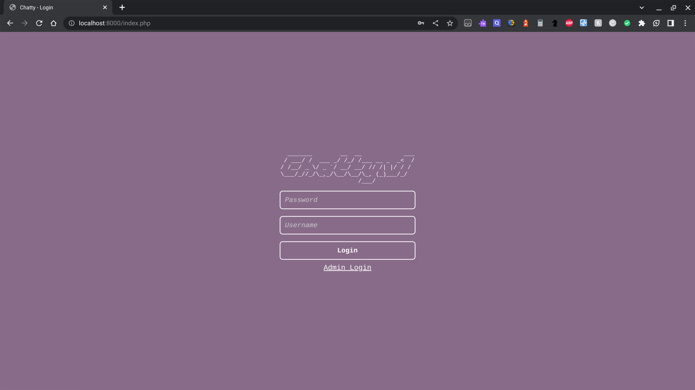

# Simple PHP Chatroom
# Chatty.V1

This is a simple PHP chatroom application with the following features:

## Login Page
Users are required to enter a password ("123test") and a username to access the chatroom.
Admins are required to enter a password ("admin123") and a username to access the chatroom (admin).

## Chatroom Page
After successful login, users are directed to the chatroom page with the following components:
- Chat Log: Displays the conversation history with timestamps and usernames.
- Message Input: Users can enter messages and send them to the chat.
- Welcome Message: Displays a welcome message with the logged-in username.
- Logout Button: Allows users to log out from the chatroom.
- Banning Users: Admin users can ban other users by entering their usernames. The banned users' messages are hidden from the chat log.
- Unbanning Users: Admin users can unban previously banned users, allowing them to participate in the chat again.
- Message Filtering: Admin users can ban specific words, and any message containing those words will be replaced with "(banned)" in the chat log.
- Clear Chat Logs: Admin users can clear the entire chat log.

## Admin Panel
There is an admin panel that requires admin login credentials to access. The admin panel provides the following functionalities:
- Ban User: Admins can ban a user by entering their username. The user's messages will be hidden from the chat log.
- Unban User: Admins can unban a previously banned user, allowing them to participate in the chat again.
- Ban Word: Admins can ban specific words. Any message containing those words will be replaced with "(banned)" in the chat log.
- Unban Word: Admins can unban previously banned words, allowing them to appear normally in the chat log.
- Clear Chat Logs: Admins can clear the entire chat log.

## Banned Users and Words
The list of banned users and banned words are stored in separate text files (`banned_users.txt` and `banned_words.txt`). This allows for easy management and persistence of banned entities.

## Usage
1. Clone the repository to your local environment.
2. Set up a PHP-enabled server (e.g., XAMPP, WAMP, or Apache) and ensure it's running.
3. Place the project files in the appropriate directory of your server.
4. Update the file paths in the PHP code as necessary.
5. Access the chatroom by navigating to the appropriate URL in your browser.
6. Login using the provided credentials and start using the chatroom.

## Acknowledgements
This chatroom application is developed using PHP and HTML. It utilizes PHP sessions for user authentication and file handling to manage chat logs, banned users, and banned words. The application provides a simple yet interactive chatroom experience with basic admin controls.
